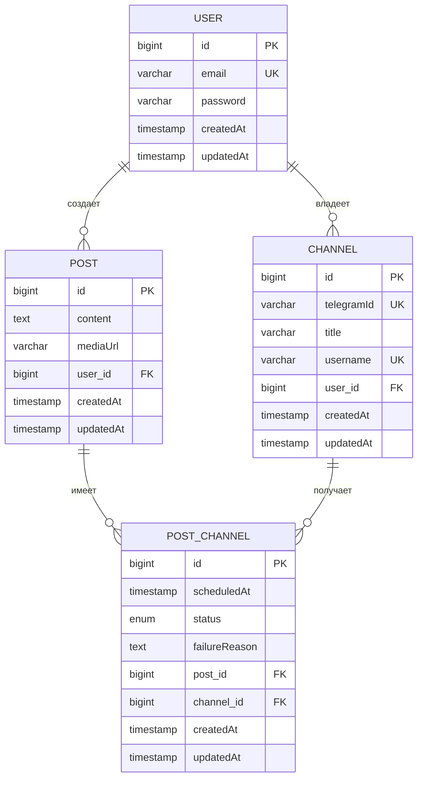

# tg-autoposter-otus

<p align="center">
  <a href="http://nestjs.com/" target="blank"></a>
</p>

## Описание

Бэкенд для автоматической публикации контента в Telegram-каналы с поддержкой гибкого расписания.

## Возможности

- ✅ Простая авторизация через email/пароль
- ✅ Регистрация новых пользователей
- ✅ JWT токены для авторизации
- ✅ Хеширование паролей (bcrypt)
- ✅ Защищенные маршруты
- ✅ PostgreSQL с TypeORM
- ✅ Управление Telegram-каналами
- ✅ Создание постов с расписанием
- ✅ Публикация в несколько каналов
- ✅ Гибкое расписание для каждого канала
- ✅ CORS поддержка
- ✅ TypeScript

## Быстрый старт

### 1. Установка зависимостей

```bash
npm install
```

### 2. Настройка базы данных

Создайте PostgreSQL базу данных и файл `.env`:

```env
# База данных
DATABASE_HOST=localhost
DATABASE_PORT=5432
DATABASE_USER=postgres
DATABASE_PASSWORD=your_password
DATABASE_NAME=tg_autoposter

# JWT
JWT_SECRET=your_jwt_secret_key

# Порт
PORT=3000
```

### 3. Запуск

```bash
# Разработка
npm run start:dev

# Продакшн
npm run start:prod
```

### 4. Тестирование

Откройте `http://localhost:3000` в браузере и используйте формы входа/регистрации.

## API Endpoints

### Авторизация
- `GET /` - Главная страница с формами авторизации
- `POST /auth/register` - Регистрация нового пользователя
- `POST /auth/login` - Вход в систему
- `GET /auth/profile` - Профиль пользователя (требует JWT)

### Каналы
- `GET /channels` - Список каналов пользователя (требует JWT)
- `POST /channels` - Добавить новый канал (требует JWT)
- `GET /channels/:id` - Получить информацию о канале (требует JWT)
- `DELETE /channels/:id` - Удалить канал (требует JWT)

### Посты
- `GET /posts` - Список постов пользователя (требует JWT)
- `POST /posts` - Создать новый пост с расписанием (требует JWT)
- `GET /posts/:id` - Получить информацию о посте (требует JWT)
- `DELETE /posts/:id` - Удалить пост (требует JWT)

## Примеры использования

### Регистрация
```bash
curl -X POST http://localhost:3000/auth/register \
  -H "Content-Type: application/json" \
  -d '{"email":"test@example.com","password":"password123"}'
```

### Вход
```bash
curl -X POST http://localhost:3000/auth/login \
  -H "Content-Type: application/json" \
  -d '{"email":"test@example.com","password":"password123"}'
```

### Получение профиля
```bash
curl -H "Authorization: Bearer YOUR_JWT_TOKEN" \
  http://localhost:3000/auth/profile
```

### Добавление канала
```bash
curl -X POST http://localhost:3000/channels \
  -H "Authorization: Bearer YOUR_JWT_TOKEN" \
  -H "Content-Type: application/json" \
  -d '{"telegramId":"-1001234567890","title":"Мой канал","username":"@my_channel"}'
```

### Создание поста с расписанием
```bash
curl -X POST http://localhost:3000/posts \
  -H "Authorization: Bearer YOUR_JWT_TOKEN" \
  -H "Content-Type: application/json" \
  -d '{
    "content": "Текст поста",
    "mediaUrl": "https://example.com/image.jpg",
    "channels": [
      {"channelId": 1, "scheduledAt": "2024-01-10T10:00:00Z"},
      {"channelId": 2, "scheduledAt": "2024-01-10T15:30:00Z"}
    ]
  }'
```

## Структура проекта

```
src/
├── auth/
│   ├── strategies/
│   │   └── jwt.strategy.ts       # JWT стратегия
│   ├── guards/
│   │   └── jwt-auth.guard.ts     # JWT guard
│   ├── auth.controller.ts         # Контроллер аутентификации
│   ├── auth.service.ts            # Сервис аутентификации
│   └── auth.module.ts             # Модуль аутентификации
├── users/
│   ├── user.entity.ts             # Сущность пользователя
│   ├── users.service.ts           # Сервис пользователей
│   └── users.module.ts            # Модуль пользователей
├── channels/
│   ├── channel.entity.ts          # Сущность канала
│   ├── channels.controller.ts     # Контроллер каналов
│   ├── channels.service.ts        # Сервис каналов
│   └── channels.module.ts         # Модуль каналов
├── posts/
│   ├── post.entity.ts             # Сущность поста
│   ├── post-channel.entity.ts     # Сущность расписания
│   ├── posts.controller.ts        # Контроллер постов
│   ├── posts.service.ts           # Сервис постов
│   └── posts.module.ts            # Модуль постов
├── config/
│   ├── auth.config.ts             # Конфигурация JWT
│   └── db.config.ts               # Конфигурация базы данных
└── main.ts                        # Главный файл приложения

public/
└── index.html                     # Страница авторизации
```

## Безопасность

- Пароли хешируются с помощью bcrypt
- JWT токены с сроком действия 1 день
- Защищенные маршруты через guards
- Валидация входных данных

## Схема базы данных



## Дополнительные возможности

Для расширения функциональности можно:
1. Добавить refresh токены
2. Реализовать роли и права доступа
3. Добавить логирование
4. Реализовать восстановление пароля
5. Добавить email верификацию
6. Добавить интеграцию с Telegram Bot API для публикации постов
7. Реализовать планировщик для автоматической отправки постов

[circleci-image]: https://img.shields.io/circleci/build/github/nestjs/nest/master?token=abc123def456
[circleci-url]: https://circleci.com/gh/nestjs/nest

  <p align="center">A progressive <a href="http://nodejs.org" target="_blank">Node.js</a> framework for building efficient and scalable server-side applications.</p>
    <p align="center">
<a href="https://www.npmjs.com/~nestjscore" target="_blank"></a>
<a href="https://www.npmjs.com/~nestjscore" target="_blank"></a>
<a href="https://www.npmjs.com/~nestjscore" target="_blank"></a>
<a href="https://circleci.com/gh/nestjs/nest" target="_blank"></a>
<a href="https://discord.gg/G7Qnnhy" target="_blank"></a>
<a href="https://opencollective.com/nest#backer" target="_blank"></a>
<a href="https://opencollective.com/nest#sponsor" target="_blank"></a>
  <a href="https://paypal.me/kamilmysliwiec" target="_blank"></a>
    <a href="https://opencollective.com/nest#sponsor"  target="_blank"></a>
  <a href="https://twitter.com/nestframework" target="_blank"></a>
</p>
  <!--[](https://opencollective.com/nest#backer)
  [](https://opencollective.com/nest#sponsor)-->

## Description

[Nest](https://github.com/nestjs/nest) framework TypeScript starter repository.

## Project setup

```bash
$ npm install
```

## Compile and run the project

```bash
# development
$ npm run start

# watch mode
$ npm run start:dev

# production mode
$ npm run start:prod
```

## Run tests

```bash
# unit tests
$ npm run test

# e2e tests
$ npm run test:e2e

# test coverage
$ npm run test:cov
```

## Deployment

When you're ready to deploy your NestJS application to production, there are some key steps you can take to ensure it runs as efficiently as possible. Check out the [deployment documentation](https://docs.nestjs.com/deployment) for more information.

If you are looking for a cloud-based platform to deploy your NestJS application, check out [Mau](https://mau.nestjs.com), our official platform for deploying NestJS applications on AWS. Mau makes deployment straightforward and fast, requiring just a few simple steps:

```bash
$ npm install -g @nestjs/mau
$ mau deploy
```

With Mau, you can deploy your application in just a few clicks, allowing you to focus on building features rather than managing infrastructure.

## Resources

Check out a few resources that may come in handy when working with NestJS:

- Visit the [NestJS Documentation](https://docs.nestjs.com) to learn more about the framework.
- For questions and support, please visit our [Discord channel](https://discord.gg/G7Qnnhy).
- To dive deeper and get more hands-on experience, check out our official video [courses](https://courses.nestjs.com/).
- Deploy your application to AWS with the help of [NestJS Mau](https://mau.nestjs.com) in just a few clicks.
- Visualize your application graph and interact with the NestJS application in real-time using [NestJS Devtools](https://devtools.nestjs.com).
- Need help with your project (part-time to full-time)? Check out our official [enterprise support](https://enterprise.nestjs.com).
- To stay in the loop and get updates, follow us on [X](https://x.com/nestframework) and [LinkedIn](https://linkedin.com/company/nestjs).
- Looking for a job, or have a job to offer? Check out our official [Jobs board](https://jobs.nestjs.com).

## Support

Nest is an MIT-licensed open source project. It can grow thanks to the sponsors and support by the amazing backers. If you'd like to join them, please [read more here](https://docs.nestjs.com/support).

## Stay in touch

- Author - [Kamil Myśliwiec](https://twitter.com/kammysliwiec)
- Website - [https://nestjs.com](https://nestjs.com/)
- Twitter - [@nestframework](https://twitter.com/nestframework)

## License

Nest is [MIT licensed](https://github.com/nestjs/nest/blob/master/LICENSE).
